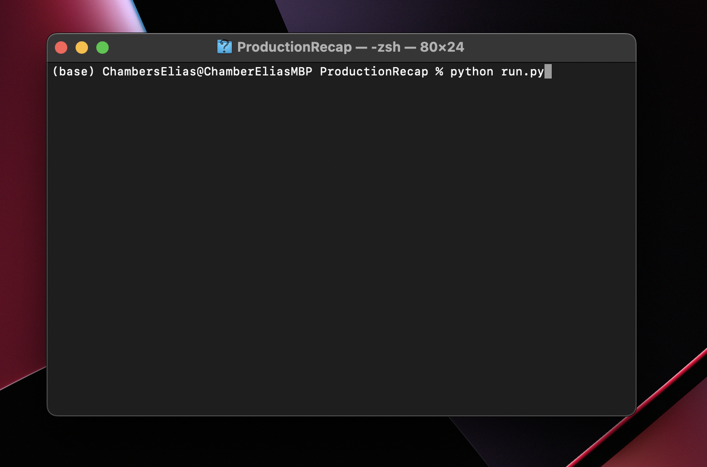
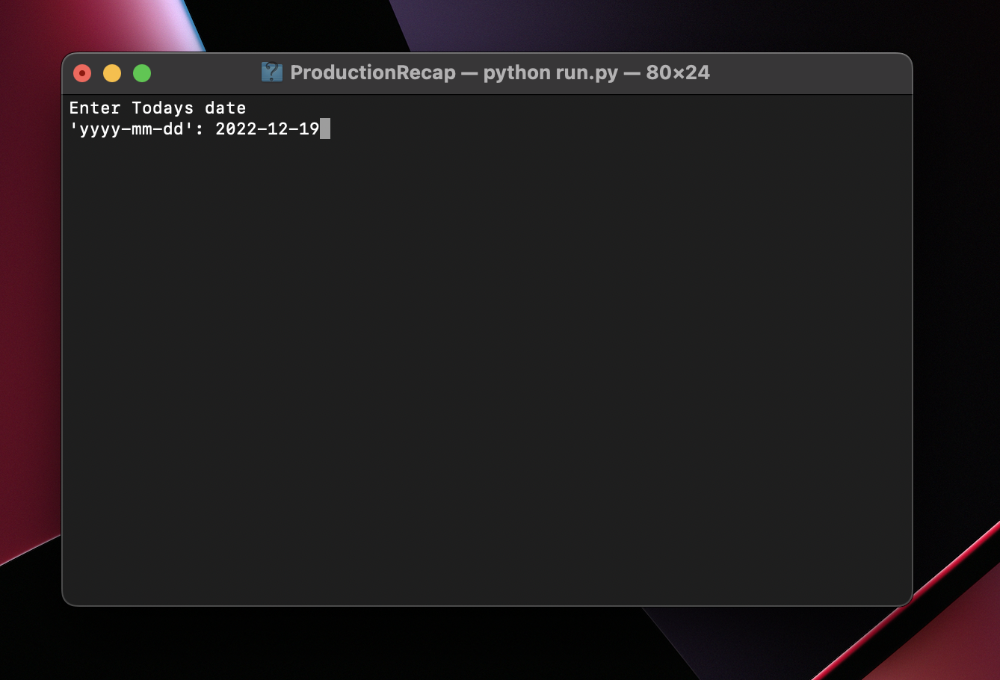

# ProductionRecap
Ability to pull data to create an end of the day production recap 
## Requirements
Install the module with pip:
```
pip3 install pandas
```
## SOP
# 1: Installation   
- Download all 3 files and move them into the same directory
# 2.: Run the 'Run.py` file 
```
python run.py
```

# 3: Enter Current Date 
- YYYY-MM-DD

# 4: Output 
