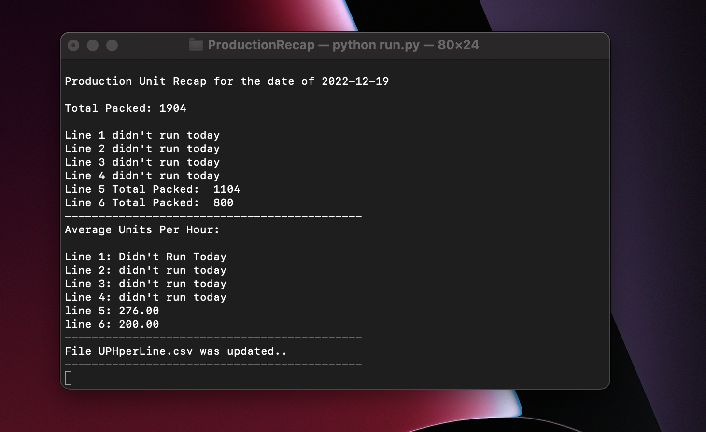
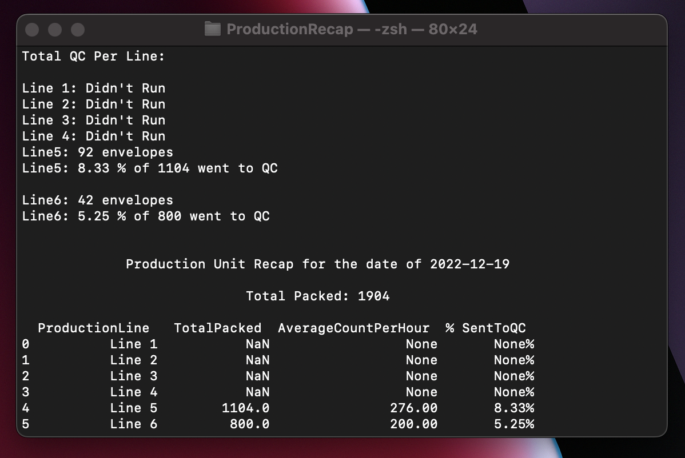
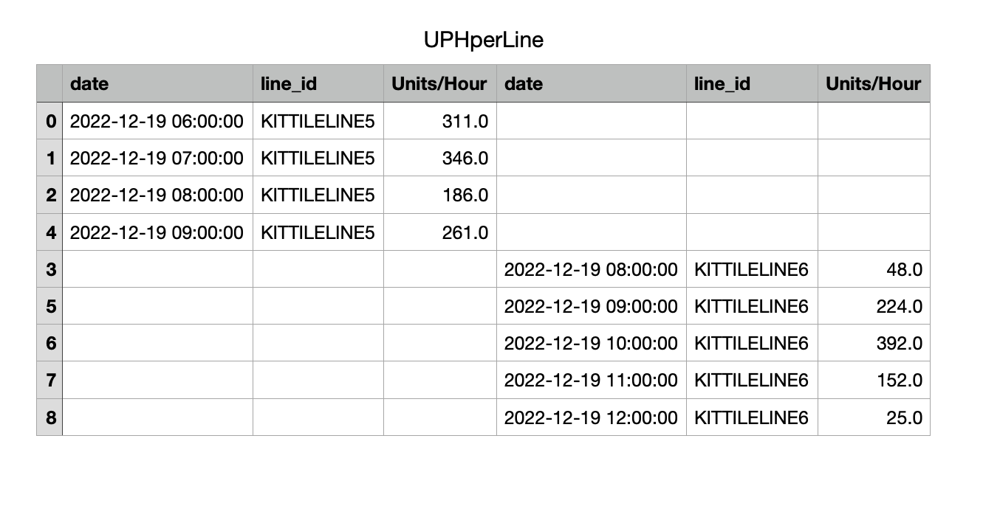

# ProductionRecap
Ability to pull data to create an end of the day production recap 
## Requirements
Install the module with pip:
```
pip3 install pandas
```
## SOP
# Installation   
- Download all 3 files and move them into the same directory
# Run the 'Run.py` file 
```
python run.py
```


# Enter Current Date 
- YYYY-MM-DD


# Output 1 - Total and Average


# Output 2 - QC Count, QC Percantage & CLI Chart Recap


# Output 3 - UPHperLine.csv

